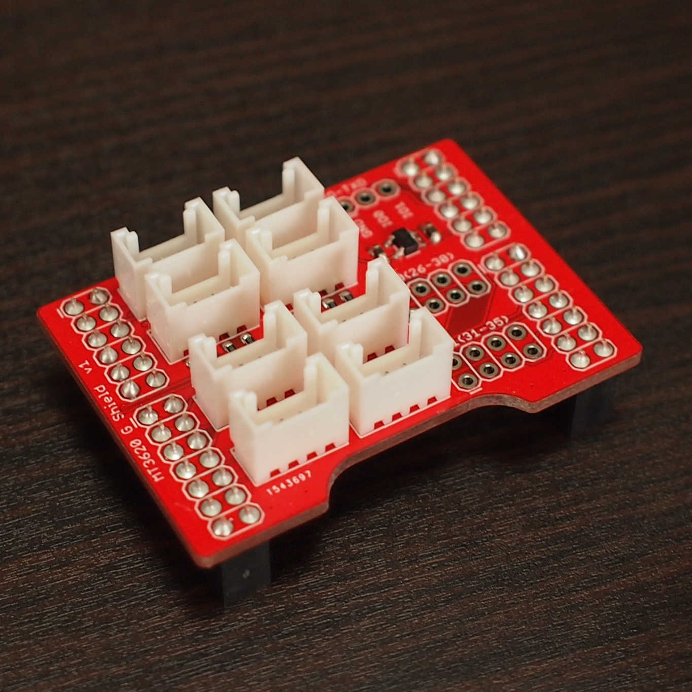

# MT3620 G Shield

Azure Sphereのリファレンス基板「MT3620開発ボード」にSeeedのGroveモジュール(3.3V対応品)を接続できるようにする、シールド基板です。

特徴:
* デジタル入出力用Grove互換コネクタ 2個
* アナログ入力用Grove互換コネクタ 2個
* UART用Grove互換コネクタ 2個(*1)
* I2C用Grove互換コネクタ 2個(*1)
* ISU全ピン引き出しピンヘッダ 2個(パッドのみ)
* Cortex-M4デバッグ用TXDピンヘッダ(パッドのみ)
* 3.3V LDO電源レギュレータ搭載

*1 ... 同一ISUで、UARTとI2Cの同時使用はできません。

## ハードウェア

### Grove互換コネクタ

使用できるGroveモジュールは、3.3V対応品のみです。
5V品は使用できません。

### ISUピンヘッダ

TODO

### Cortex-M4デバッグ用TXDピンヘッダ

TODO

## ソフトウェア

以下のプログラムで動作確認しています。

|インターフェース|プログラム|Groveモジュール|SKU|接続コネクタ|
|:--|:--|:--|:--|:--|
|デジタル出力|[buzzer](samples/buzzer)|Grove - Piezo Buzzer/Active Buzzer|107020000|GPIO4|
|アナログ入力|[rotary-angle](samples/rotary-angle)|Grove - Rotary Angle Sensor (Rotary Potentiometer)|101020017|ANALOG0|
|UART|[gps](samples/gps)|Grove - GPS Module|113020003|UART0|
|I2C|[accel-16g](samples/accel-16g)|Grove - ADXL345 - 3-Axis Digital Accelerometer(±16g)|101020054|I2C0|

## 参照

* [回路図(PDF)](hardware/mt3620-g-shield-schematic.v1.pdf)
* [サンプルプログラム](samples)
* [MT3620開発キット@Seeed wiki](https://wiki.seeedstudio.com/Azure_Sphere_MT3620_Development_Kit/)
* [MT3620開発キットJP@Seeed bazaar](https://www.seeedstudio.com/Azure-Sphere-MT3620-Development-Kit-JP-Version-p-3135.html)
